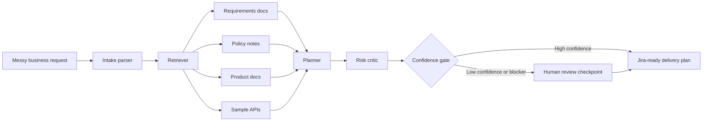

# Architecture

Company and product names in this architecture are illustrative sample scenarios only. No affiliation, endorsement, or internal access is implied.

## Components

| Component | Responsibility |
| --- | --- |
| Intake parser | Converts an unstructured stakeholder request into structured fields such as persona, systems, constraints, timeline, and missing information. |
| Retriever | Finds relevant context from requirements docs, policy notes, product docs, and API examples. |
| Planner | Drafts user stories, acceptance criteria, KPIs, risks, dependencies, and launch tasks. |
| Risk critic | Reviews the plan for compliance, integration, ownership, data, and timeline risks. |
| Confidence gate | Routes the plan to human review when confidence is low or blockers are present. |
| Publisher | Formats the output for product review and Jira handoff. |

## Knowledge Base

The prototype uses a small simulated knowledge base:

- Requirements: definition of ready, Jira readiness, rollout checklist
- Policy: customer data handling, redaction, model gateway approval
- Product: AI gateway summarization, drafting, confidence scoring
- API: ServiceNow incidents and internal parts API fields

## Production Extension

A production version would replace the deterministic demo logic with:

- LangGraph or another durable orchestration framework
- Authenticated retrieval from governed enterprise knowledge stores
- Policy-aware prompt and tool routing
- Evaluation traces for grounding, completeness, risk handling, and reviewability
- Jira, ServiceNow, or Linear publishing integrations
