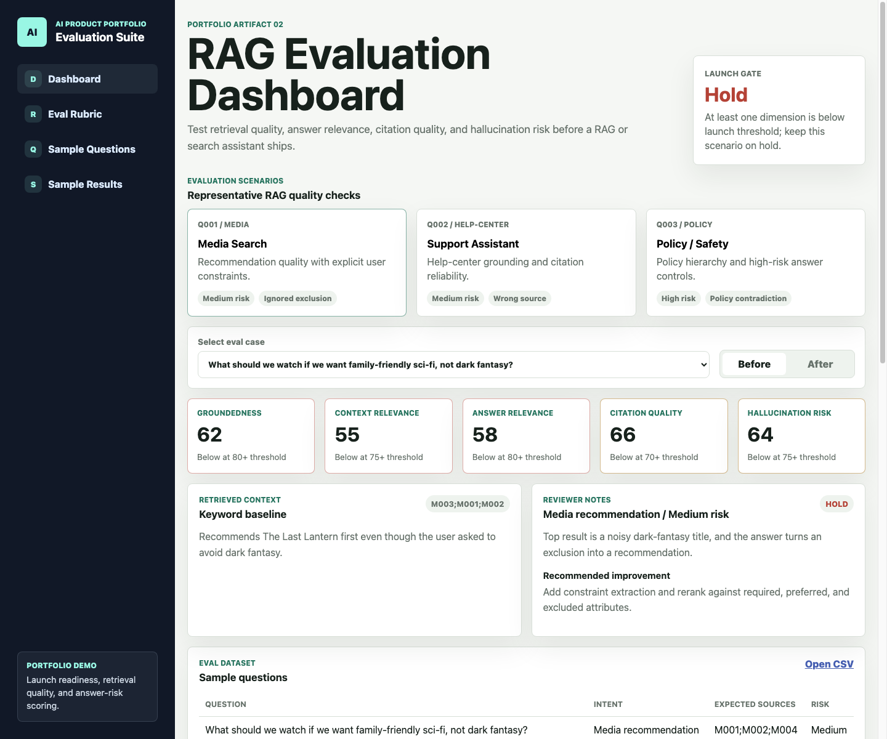
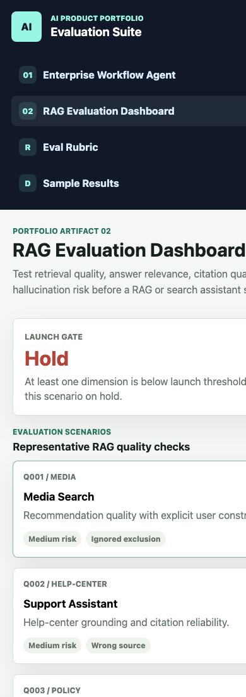

# RAG Evaluation / Search Quality Dashboard

This artifact demonstrates how to evaluate search quality and RAG answer quality for media recommendations, help-center answers, and AI assistant responses.

This project is designed as a product-quality and launch-readiness artifact, not a full production RAG implementation. It demonstrates how a team could define eval sets, score retrieval and answer quality separately, identify failure modes, and decide whether an AI assistant/search feature is ready for release.

## What Is Included

- `index.html`: local static dashboard UI for testing the eval scenarios.
- `eval_rubric.md`: scoring rubric for groundedness, context relevance, answer relevance, citation quality, and hallucination risk.
- `sample_questions.csv`: small eval set with user questions, intents, expected source IDs, and risk tiers.
- `sample_results.csv`: before/after retrieval and answer quality results with pass/fail notes.
- `screenshots/`: dashboard screenshots showing the eval experience and launch-gate framing.

## How To Discuss It

The goal is not to show that a RAG pipeline exists. The goal is to show how quality would be measured before launch:

- Retrieval quality is measured separately from final answer quality.
- Each answer is evaluated against a rubric, not just judged by vibes.
- Launch decisions use thresholds by dimension, so a high average score cannot hide a safety or citation failure.
- Failed examples become a regression set for future retriever, prompt, and model changes.

## Example Launch Threshold

An answer is launch-ready only when all required dimensions meet the threshold:

- Groundedness: 80+
- Context relevance: 75+
- Answer relevance: 80+
- Citation quality: 70+
- Hallucination risk: 75+

If any dimension falls below threshold, the scenario stays on hold and the result should include an improvement recommendation.

## Why This Matters

RAG systems can appear correct in demos while still failing in production due to weak retrieval, unsupported claims, poor citations, safety-policy conflicts, or missed user constraints.

This dashboard frames evaluation as a launch gate. The goal is to help product, engineering, data science, and compliance teams decide whether an AI answer experience is ready to ship, needs monitoring, or should remain on hold.

## Dashboard Snapshots

### Overview Dashboard

### Mobile / Compact View

