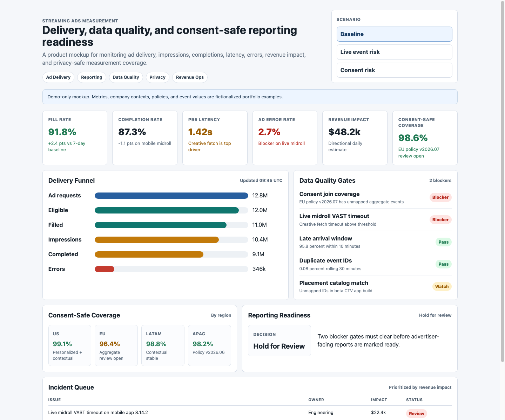
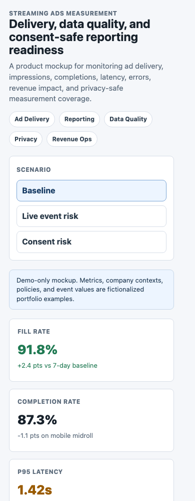

# Streaming Ads Measurement & Data Quality Product Plan

**From Ad Event Instrumentation to Privacy-Safe Measurement Readiness**

This project is a portfolio case study for streaming ads measurement, data quality, reporting readiness, and privacy-aware analytics. It demonstrates how a product team could define canonical ad events, monitor delivery health, detect measurement defects, and connect technical quality issues to revenue and compliance risk.

This is a product and data-platform case study, not a production ad server or real integration with any media company, DSP, SSP, or streaming platform.

## Demo-Use Disclaimer

Company and product names in this project are used only as illustrative sample scenarios. This project is not affiliated with, endorsed by, or based on internal information from Paramount, The Trade Desk, NBCUniversal, Roku, WBD, Disney, or any other referenced company. All metrics, policies, event payloads, screenshots, dashboards, and outputs are fictionalized for portfolio demonstration purposes.

## Why This Matters

Streaming ads measurement sits at the intersection of ad delivery, user experience, reporting, revenue operations, privacy, and data quality. A small break in event instrumentation can create large downstream problems: missing impressions, low fill visibility, inflated completion rates, advertiser disputes, compliance exposure, and revenue leakage.

This plan treats consent-safe measurement coverage and data quality as first-class product metrics, not back-office cleanup.

## Product Problem

Ad delivery and measurement teams need a reliable way to answer:

- Did an eligible ad request happen?
- Was the request filled?
- Did the ad impression actually start?
- Did the ad complete?
- Did an error occur, and at what stage?
- Was measurement allowed under the viewer's consent status?
- Which defects are material enough to block reporting or escalate based on revenue impact?

Without a shared schema and dashboard, teams end up reconciling delivery logs, reporting tables, privacy states, and revenue estimates manually.

## What This Case Study Produces

- Canonical event schema for `ad_request`, `ad_impression`, `ad_complete`, `ad_error`, and `consent_status`
- KPI framework for fill rate, completion rate, latency, ad error rate, revenue impact, and consent-safe measurement coverage
- Data quality checks and reporting publish gates
- Static dashboard mockup for delivery, measurement, privacy, and incident triage
- Rollout plan from schema discovery to reporting gate
- Risk register with owner, severity, and mitigation

## Included Files

- `index.html` - local static dashboard UI for reviewing the product surface.
- `app.js` - deterministic scenario logic for dashboard metrics and incident details.
- `styles.css` - responsive dashboard styling aligned with the other portfolio artifacts.
- `architecture.md` - product architecture, event flow, quality gates, and operating model.
- `event_schema.json` - sample event schema and fictional payloads.
- `data_quality_checks.md` - validation rules, blocker checks, alerting model, and reporting gate.
- `sample_input.json` - example product context, KPI targets, and event counts.
- `sample_output.md` - example product plan output and reporting readiness decision.
- `risk_register.csv` - structured risk register for product and delivery review.
- `screenshots/` - visual snapshots for the dashboard overview and compact view.

## How To Run

Open `index.html` in a browser. Use the scenario buttons to compare normal operations, live-event delivery risk, and consent coverage risk. The dashboard updates KPI cards, quality gates, incident details, and reporting readiness.

## Dashboard Snapshots

### Overview Dashboard

### Mobile / Compact View

## Product KPIs

| KPI | Definition | Product Use |
| --- | --- | --- |
| Fill Rate | Filled ad requests / eligible ad requests | Measures inventory monetization and demand-path health |
| Completion Rate | Completed ads / impressions | Measures playback quality and advertiser value |
| P95 Latency | Time from ad request to first ad frame | Connects ad delivery to viewer experience |
| Ad Error Rate | Ad errors / ad requests | Shows technical failure rate by stage and platform |
| Revenue Impact | Estimated lost impressions x blended CPM / 1000 | Converts defects into prioritization signal |
| Consent-Safe Measurement Coverage | Events with valid consent mode / measurable events | Makes privacy-safe measurement visible before reporting |

## Data Quality Gates

Advertiser-facing reports should stay on hold when:

- consent mode is missing or invalid for measurable events
- duplicate event IDs exceed the blocker threshold
- `ad_impression` or `ad_complete` cannot be mapped to a prior request
- placement or campaign IDs do not map to an active catalog
- completion duration is outside plausible creative bounds
- late-arriving events have not cleared the reporting freshness window

## Portfolio Positioning

This project is especially relevant for product roles in ads measurement, streaming analytics, data platforms, reporting products, privacy-safe measurement, and ad delivery operations.

Best-fit role signals:

- Lead PM, Ad Delivery or Ads Measurement
- Product Manager, Reporting and Data Quality
- Product Manager, Streaming Analytics
- Ads Compliance or Privacy Measurement PM
- Data Platform TPM for event instrumentation and observability

Example target contexts include Paramount, The Trade Desk, NBCUniversal, Roku, WBD, and Disney, used here only as portfolio-positioning examples.

## Accuracy Note

This is a fictionalized portfolio case study designed to show product judgment, data-modeling clarity, launch-risk thinking, and dashboard design. In a production version, event ingestion would use governed pipelines, consent rules would come from approved privacy systems, revenue estimates would reconcile against billing sources, and reporting gates would be integrated with authenticated data workflows.
