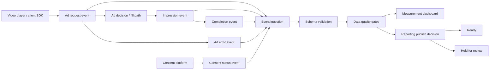

# Product Architecture

## Purpose

This case study defines a product layer for streaming ads measurement and data quality. The goal is to help product, data, revenue operations, engineering, and privacy teams understand whether ad delivery events are complete, ordered, consent-safe, and ready for advertiser-facing reporting.

## Conceptual Flow

## Core Components

| Component | Responsibility | Product Owner |
| --- | --- | --- |
| Client Event Instrumentation | Emits ad request, impression, complete, error, and consent events | Client Platform |
| Event Contract | Defines required fields, enums, identifiers, and event-order rules | Data Platform |
| Consent Join | Confirms measurement mode is allowed before downstream joins | Privacy/Data |
| Quality Gate | Blocks or warns on missing fields, duplicates, late arrivals, catalog mismatches, and consent gaps | Data Quality |
| Dashboard | Shows KPIs, quality checks, incidents, and reporting readiness | Ads Measurement PM |
| Reporting Publish Decision | Marks reports as ready, preliminary, or hold for review | Measurement PM |

## Event Contract

The canonical events are:

- `ad_request`: the player or ad SDK asks for an eligible ad.
- `ad_impression`: an ad starts rendering or playing.
- `ad_complete`: the ad reaches the required completion threshold.
- `ad_error`: delivery fails at a known stage.
- `consent_status`: consent mode and policy proof are recorded for measurement.

Required business identifiers:

- `placement_id`
- `content_id`
- `ad_break_id`
- `campaign_id`, when applicable
- `creative_id`, when applicable
- `consent_status`
- `measurement_mode`

## Data Quality Gates

Block advertiser-facing reporting when:

1. Required fields are missing.
2. Consent mode is invalid for the measurement join.
3. Events arrive out of order and cannot be reconciled.
4. Duplicate event IDs exceed blocker threshold.
5. Placement or campaign IDs are unmapped.
6. Completion duration is implausible for the creative.

Warnings are allowed for lower-risk issues such as late arrivals inside the freshness window, content catalog drift below threshold, or non-blocking enum drift.

## Dashboard Model

The dashboard is designed around four decision layers:

1. Delivery health: fill, impressions, completions, errors, latency.
2. Measurement quality: duplicates, late arrivals, ordering, schema completeness.
3. Privacy safety: consent-safe coverage by region and policy version.
4. Business impact: estimated revenue impact and incident priority.

## Operating Model

| Meeting / Review | Cadence | Decision |
| --- | --- | --- |
| Delivery Health Review | Daily | Triage fill, latency, and error regressions |
| Data Quality Review | Daily during rollout, weekly after stabilization | Decide whether blocker checks are tuned correctly |
| Privacy Review | On schema or policy changes | Approve measurement mode and consent coverage rules |
| Reporting Readiness Review | Before advertiser report publish | Ready, preliminary, or hold for review |

## Production Considerations

- Use idempotent event writes and stable event IDs.
- Version schemas and policy rules.
- Keep revenue impact labeled as directional until reconciled with billing.
- Separate operational dashboards from advertiser-facing report exports.
- Maintain human review for blocker gates that affect billing, privacy, or advertiser trust.
